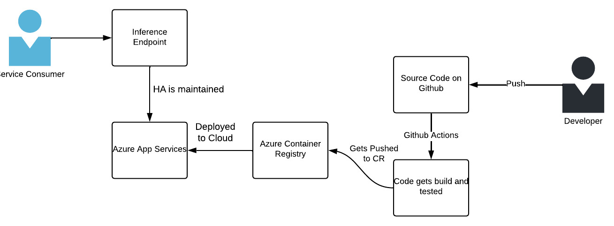

# EGL ML CHALLENGE

### Public Endpoint and other details - 

Home page - https://agl-challenge.azurewebsites.net/

The schema is available here - https://agl-challenge.azurewebsites.net/docs

Currently, only 1 user exists in the database which is hardcoded.

username - abi
password - password

### Below is a high-level architectural design of the system I have built.

The system is basically a robust pipeline of events that are executed in a specific order.

1. The developer 'pushes' the code to a specific branch, in this case, `master`.
2. CI/CD pipeline is triggered which is powered by GH Actions.
3. The pipeline consists of jobs such as - build, test, packaging and deployment.

### Code Details

1. auth.py - This file is handling the logic of authenticating users by verifying the username and hashed password. 
2. Dockerfile - This is the dockerfile of the code which when run, deploys the model to a local endpoint.
3. main.py - This file contains the definition of all the endpoints our service exposes. Few endpoints are protected as they need Bearer token code.
4. requirements.txt - This is the file with all the python library requirements. This will help setup our docker or virtual environment.
5. slr.pkl - This is the pickle file of our model.
6. test_main.py -  This file contains couple of unit tests I added to show as an example.

### RESPONSES TO THE QUESTIONS ASKED

****Q.** Does your solution work end to end?**

**A.** Yes, the solution has been implemented to work end-to-end. The developer is responsible to push the code to the `master` branch which will trigger the CI/CD pipeline.
The said pipeline will take care of building, testing, packaging and deployment.

****Q.** Are there any unit tests or integration tests?**

**A.** Yes, as an example, I have added couple of unit tests which will be executed as part of the pipeline.

****Q.** Has security/monitoring been considered?**

**A.** Yes, as an example of how it would work in a real production environment, I have added Web API Token based Authentication to gain access to the API. If the user has access to the system, they will be granted a token if valid credentials are passed, otherwise, they can't access the inference endpoint.

****Q.** How is your solution documented? Is it easy to build on and for other developers to understand?**

**A.** Proper comments are added wherever necessary and additional documentation has been prepared to help other developers get started.

****Q.** How performant is your solution both from a code perspective and a scalability perspective as a service?**

**A.** The solution right now is pretty stable from code perspective but from scalability perspective, it is not highly scalable at the moment.
To make it scalable, the Azure App Service needs to use Kubernetes which will help in addition of additional pods/resources whenever needed. We should have a fair idea of -
    - how many requests per seconds we will be handling
    - what's the latency of our service after deploying it to the cluster (cloud)
Using these 2 numbers, we can make an estimate of the number of pods we will need to provide HA to our customers.

****Q.** Has due consideration been given to what a production ML system would require? This could be interactions or dependencies with other systems.**

**A.** A production ML system would ideally be deployed as a microservice which would be independent of other models deployed in a similar fashion or other microservices. 
The ML system would rely on a Feature Store to gain access to data which the model will need to make the prediction. It can also rely on feature data exposed as endpoints by other systems.

### Bonus stuff I did for this challenge

1. I realised that production grade ML systems might sometimes rely on heavy static files, in this case, I chose to treat .pkl file as an heavy file which may cross Github's limits.
I researched how to use git-lfs in the context of Github actions to keep it working. It took me sometime but it went well.

2. I also included a `predict_class` endpoint in case we want to see the output as a class instead of a contionuous value.

### Few things I wanted to talk about

1. A proudction ML system needs to have efficient logging mechanishm which can be used to recreate a process flow for a given user in case we need to do some investigation. I couldn't implement it but I did some researcha and found a way to output model logs and then create dashboards on it using Azure Insights feature. 

2. A production ML system needs to have proper alerts in case the failure rate goes above a certain limit. I found out this can be easily implemented in Azure tool.

3. A production ML system needs to have proper dashboards showing latency of the model as a whole, latency of the feature calls it is making, latency of the model without the feature calls, error rate for the feature pulls, error rate of the model as a whole, etc. which I researched how to implement but couldn't due to lack of time.

